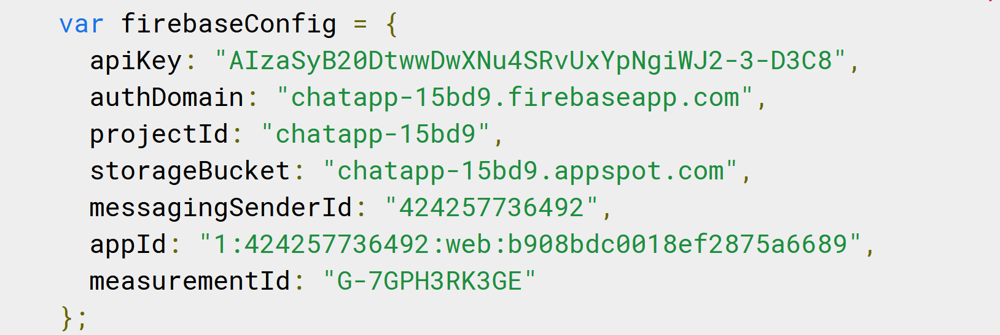
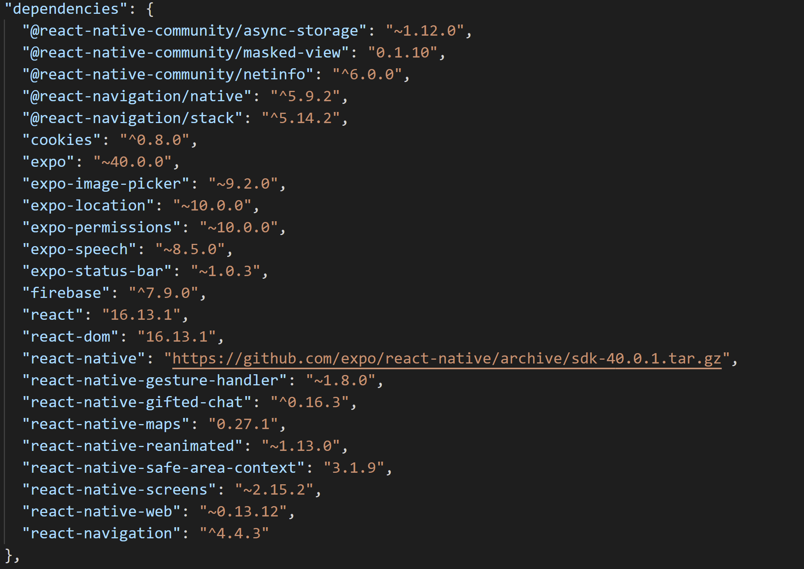

## Introduction

Chat-App is an app that will provide users with a chat interface to allow to communicate with their friends, family or people they know. This app allows them to not only send messages but also to share images as well as their location.

## Get Started

To run the app, first you must install Expo to your device. To learn more about Expo, visit [Expo's](https://expo.io/) main page. Next, install:

```
npm install expo-cli -g
```

And, to run:

```
expo/npm start
```

To set up Android Emulator, install [Android Studio](https://developer.android.com/studio).

### Set up Firebase

To get started, visit [Google Firebase](https://firebase.google.com/) and sign in. Once signed in, Go to the console and click on "Create Project". After the project created, you need to create a database and select **start in test mode**. And from that you can now start creating your collections. In order to display you data from Firestore database in app, you need to click the **</>** or Firestore web button. Click "Register" to generate the configuration code. Which look like this:

<!--  -->


Copy the contents and integrate it into your "App.js" file.

## Dependencies

<!--  -->


## Main Page

<!--  -->


## Chat Box Page

<!--  -->


## Kanban

[Kanban Board](https://trello.com/b/nVbZLYmk/chat-app-kanban-board)
